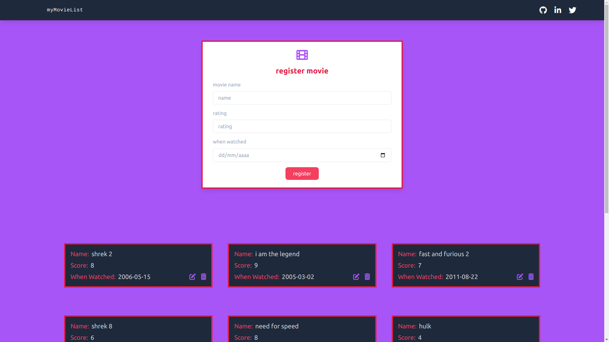

## MovieLaravel

## The idea

I've started this project when learned my first things about Laravel, the idea was to recreate an old personal PHP project, where 
people can rate the movies they have already watched.
<br>
In the project the user can create their own profile, where they are going to rate the movies they want.

## Install the project
```
# clone the project
$ git clone git@github.com:thalesmengue/movieLaravel.git

# install the dependencies
$ composer install

# make a copy of the .env file
$ cp .env.example .env

# set the environment variables from your database to the .env file

# generate a new key to the project
$ php artisan key:generate

# run the migrations
$ php artisan migrate

# run the application
$ php artisan serve
```

## Technologies:
- [PHP 8.0](https://www.php.net/docs.php)
- [Laravel 9.19](https://laravel.com/docs/9.x/installation)
- [Tailwind 3.1.8](https://tailwindcss.com/docs/installation)



